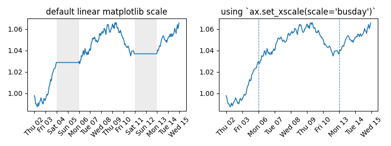

# busdayaxis

A Matplotlib scale that compresses non-business days and off-hours. Every visible unit on the axis corresponds to active time — no gaps for weekends, holidays, or overnight periods. No data preprocessing needed.



The scale is implemented as a proper `ScaleBase` subclass and participates fully in Matplotlib's transform pipeline: autoscaling, shared axes, and all standard artists (`plot`, `scatter`, `bar`, `axvline`, `fill_between`, …) work out of the box.

## Installation

```bash
pip install busdayaxis
```

## Quick Start

```python
import matplotlib.pyplot as plt
import busdayaxis

busdayaxis.register_scale()  # register once at the start of your script

fig, ax = plt.subplots()
ax.plot(dates, values)
ax.set_xscale("busday")  # compress weekends (Mon–Fri default)
```

See the [API reference](api.md) for full parameter documentation and the [Examples](generated/gallery) for practical use cases.

## Usage

There are two equivalent ways to apply the scale:

### String-based

Requires a prior call to `busdayaxis.register_scale()`.

Pass the registered name `"busday"` to `set_xscale` along with keyword arguments taken by [`BusdayScale`](api.md#busdayaxis.BusdayScale). The `axis` parameter is excluded as it is automatically provided by the `ax.set_xscale()` call.

```python
import matplotlib.pyplot as plt
import busdayaxis

busdayaxis.register_scale()  # register once at the start of your script

fig, ax = plt.subplots()
ax.plot(dates, values)

ax.set_xscale("busday")  # compress weekends (Mon–Fri default)
# or
ax.set_xscale(  # compress weekends + overnight gaps
    "busday", bushours=(9, 17)
)
# or
ax.set_xscale(  # per-day business hours
    "busday", bushours={"Mon": (9, 17), "Fri": (9, 16)}
)
# or
ax.set_xscale( # custom week mask and holidays
    "busday",
    weekmask="Sun Mon Tue Wed Thu",
    holidays=["2025-01-01"]
)
```

### Class-based

Instantiate `BusdayScale` directly and pass it to `set_xscale`. No prior
`register_scale()` call needed. The class is fully typed, so IDEs provide
parameter completion and inline documentation.

```python
from busdayaxis import BusdayScale

ax.set_xscale(BusdayScale(ax.xaxis))  # compress weekends (Mon–Fri default)
# or
ax.set_xscale(  # compress weekends + overnight gaps
    BusdayScale(ax.xaxis, bushours=(9, 17))
)
# or
ax.set_xscale(  # per-day business hours
    BusdayScale(ax.xaxis, bushours={"Mon": (9, 17), "Fri": (9, 16)})
)
# or
ax.set_xscale(  # custom week mask and holidays
    BusdayScale(ax.xaxis, weekmask="Sun Mon Tue Wed Thu", holidays=["2025-01-01"])
)
```

The default `BusdayScale(ax.xaxis)` is equivalent to `ax.set_xscale("busday")`: both compress Saturdays and Sundays while leaving all other time visible.

### Custom tick placement

`busdayaxis` provides business-day-aware wrappers for every standard Matplotlib date locator. Each wrapper delegates tick placement to the underlying locator and then filters out any ticks that fall on non-business days or outside active business hours.

| `busdayaxis` locator | Wraps                       |
|----------------------|-----------------------------|
| `AutoDateLocator`    | `mdates.AutoDateLocator`    |
| `YearLocator`        | `mdates.YearLocator`        |
| `MonthLocator`       | `mdates.MonthLocator`       |
| `WeekdayLocator`     | `mdates.WeekdayLocator`     |
| `DayLocator`         | `mdates.DayLocator`         |
| `HourLocator`        | `mdates.HourLocator`        |
| `MinuteLocator`      | `mdates.MinuteLocator`      |
| `SecondLocator`      | `mdates.SecondLocator`      |
| `MicrosecondLocator` | `mdates.MicrosecondLocator` |
| `MidBusdayLocator`   | *(custom — see below)*      |

All locators read the `weekmask`, `holidays`, and `bushours` configuration directly from the axis, so they automatically stay in sync with the active `BusdayScale`.

You can also wrap any third-party or custom locator with the base `BusdayLocator`:

```python
import matplotlib.dates as mdates
import busdayaxis

ax.set_xscale("busday", bushours=(9, 17))

# Hourly ticks only within business hours
ax.xaxis.set_major_locator(busdayaxis.HourLocator())

# Every other business day
ax.xaxis.set_major_locator(busdayaxis.DayLocator(interval=2))

# Every Monday that is a business day
ax.xaxis.set_major_locator(busdayaxis.WeekdayLocator(byweekday=mdates.MO))

# Wrap a custom locator
ax.xaxis.set_major_locator(busdayaxis.BusdayLocator(my_custom_locator))
```

#### MidBusdayLocator

`MidBusdayLocator` is a special locator that places one tick at the midpoint of the business session for each business day. It is not a filter wrapper — it computes midpoints directly from the `bushours` configuration, including per-day schedules.

Its primary use is centering day labels inside each session:

```python
ax.set_xscale("busday", bushours=(9, 17))

# Major ticks at session boundaries, minor ticks centred for day labels
ax.xaxis.set_minor_locator(busdayaxis.MidBusdayLocator())
ax.xaxis.set_minor_formatter(mdates.DateFormatter("%a"))
```
